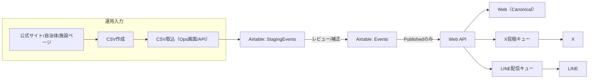
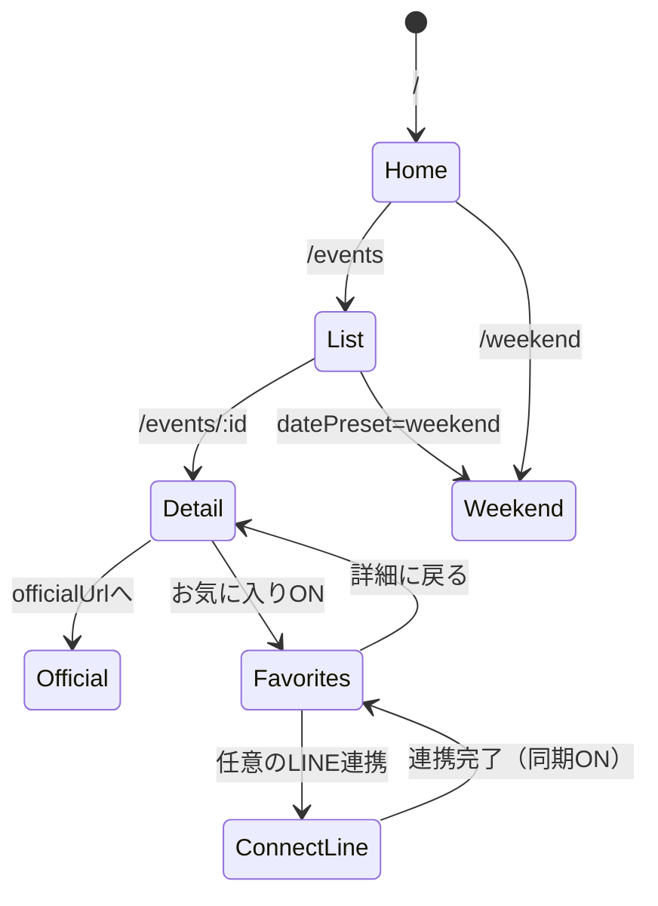

# A-2025-001_knowledge_pack_v0.11.0
キッズお出かけ情報（Web Canonical + X + LINE）仕様・設計ナレッジパック（Cursor向け）

- 更新日: 2026-01-01
- 前版: A-2025-001_knowledge_pack_v0.10.0
- 本版の追加: **ユーザーUI導線**（公開画面 + Ops画面）と **CSV作成/取り込み仕様案** を統合

---

## 1. 目的 / ゴール

### 1.1 目的
- キッズ向けイベント情報を **WebをCanonical（母艦）** として正規化し、
  - X: イベント単位で拡散
  - LINE: 新規/予約リマインド/週次（週末特集）
 で配信する。

### 1.2 ゴール（MVP）
- **登録強制なし**（匿名でお気に入り保存 → 任意でLINE連携へ誘導）
- **信頼性担保**（Web詳細に「公式URL・更新日・免責」を必須表示）
- **ゼロ件回避**（検索0件でも週末特集/条件緩和提案へ誘導）
- **AirtableをSoT（Single Source of Truth）** として運用を成立させる

### 1.3 非ゴール（MVPではやらない）
- 決済/チケット販売/在庫連携
- 自動クローリングの完全自動化（まずはCSV取り込みで品質を固める）
- 個別最適レコメンド（機械学習）

---

## 2. WebをCanonical（母艦）にする理由
- X/LINEを「拡散・通知」専用にし、**参照先をWeb詳細に固定**するため。
- 公式URL/更新日/免責を一貫して表示し、**信頼性をUIで担保**するため。
- 同一イベントの重複投稿/再送を、canonicalUrl と eventId で抑制しやすい。

---

## 3. チャネル方針（開始時点）

### 3.1 Web（Canonical）
- 公式URL・更新日・免責を必須表示
- 検索/週末特集/お気に入り/LINE連携導線

### 3.2 X（イベント単位拡散）
- 1イベント=1投稿（Canonical詳細に誘導）
- 投稿テンプレ固定
- 投稿頻度上限（スパム化防止）

### 3.3 LINE（新規/予約リマインド/週次）
- 新規: Publishedを条件付き配信
- 予約リマインド: **ユーザーが登録したものだけ**（Hard Failを厳格化）
- 週次: 週末特集（Weekend）を定期配信

---

## 4. 全体アーキテクチャ

### 4.1 SoT（Single Source of Truth）
- AirtableをSoTとして、下記2テーブルで運用。
  - `StagingEvents`（取り込み/レビュー）
  - `Events`（公開対象）

### 4.2 出力
- Web: `/events` / `/events/:id` / `/weekend`
- X: イベント単位投稿
- LINE: 新規/予約/週次

### 4.3 データフロー（高レベル）


---

## 5. ユーザー種別（導線設計の前提）

### 5.1 閲覧ユーザー（匿名）
- 目的: 近場のイベントを素早く探す
- 行動: 検索 → 詳細 → 公式へ →（必要なら）お気に入り
- 制約: 端末間同期なし（LocalStorage）

### 5.2 LINE連携ユーザー
- 目的: 週末のまとめ受領、予約のリマインド、端末引き継ぎ
- 行動: お気に入り → LINE連携 → 週次/予約リマインド

### 5.3 Ops（入力/編集/公開）
- 目的: CSV取り込み→品質チェック→Published
- 行動: Import → Stagingレビュー → Eventsへ昇格 → Published

---
## 6. UX方針（導線破綻を防ぐルール）

### 6.1 登録強制しない
- 匿名で「お気に入り」まで完結（価値提供を先に）
- LINE連携は **メリット提示（週次/予約/引き継ぎ）** で任意誘導

### 6.2 信頼性表示
- 詳細（Canonical）に **必ず表示**
  - 公式URL（リンク/ボタン）
  - 更新日（updatedAt）
  - 免責（「情報は変更される可能性…」など固定文言で可）

### 6.3 ゼロ件回避
- 検索結果0件でも“次の一手”をUIで必ず提示
  - 条件緩和（距離/日付/年齢）
  - `/weekend` へ誘導
  - 人気カテゴリ/エリアのショートカット

---

## 7. Web画面仕様（公開UI + Ops UI）

### 7.1 公開画面一覧
- `/`（ホーム）
- `/events`（一覧・検索）
- `/events/:id`（詳細・Canonical）
- `/weekend`（週末特集）
- `/favorites`（お気に入り）
- `/connect/line`（LINE連携）

### 7.2 Ops画面一覧（内部）
- `/ops/import-csv`（CSV取込）
- `/ops/staging`（ステージングレビュー）
- `/ops/events/:id`（編集/Publish）

### 7.3 画面遷移（匿名→保存→任意LINE連携）


### 7.4 各画面のUI要素案と受入条件（抜粋）

#### `/` ホーム
- UI要素
  - 検索バー（キーワード）
  - datePresetチップ（今日/今週/週末）
  - エリア（代表エリア/駅）
  - 年齢（0-2/3-5/6-12 等）
  - 週末特集（大枠）
  - 「お気に入りは匿名でOK」説明
- 受入条件
  - **検索→一覧→詳細** が1アクションで到達
  - 週末特集は常時見える（0件時の逃げ道にもなる）

#### `/events` 一覧・検索
- UI要素
  - フィルタ: datePreset/期間/エリア/年齢/カテゴリ/価格/予約要否
  - ソート: `recommended`（既定）/ `startAt` / `updatedAt`
  - イベントカード: タイトル、日付、エリア、年齢、料金、予約要否、更新日
  - 0件UI: 条件緩和提案 + `/weekend` + 人気カテゴリ
- 受入条件
  - クエリパラメータで再現できる（共有/戻るで崩れない）

#### `/events/:id` 詳細（Canonical）
- UI要素（ファーストビューで必須）
  - 公式URL（ボタン）
  - 更新日（updatedAt）
  - 免責
  - お気に入りトグル
- 追加要素
  - 予約情報（required/url/deadlineAt）
  - Xシェア
- 受入条件
  - officialUrl/updatedAt 欠落イベントは **Webに出ない**（APIで弾く）

#### `/weekend` 週末特集
- UI要素
  - 対象期間（Sat-Sun）
  - 軽い絞り込み（エリア/年齢）
  - 特集枠（編集枠 or ルールベース）
- 受入条件
  - 週次LINEから遷移して破綻しない（固定パラメータ/固定期間）

#### `/favorites` お気に入り
- UI要素
  - 保存済み一覧（匿名: LocalStorage）
  - 「端末依存」注意
  - LINE連携CTA（引き継ぎ/週次/リマインド）
- 受入条件
  - 未連携でも閲覧/解除が可能

#### `/connect/line` LINE連携
- UI要素
  - 連携メリット（週次/予約/引き継ぎ）
  - 保存するデータ（最小化の明示）
  - 連携ボタン（LIFF/OAuth想定）
- 受入条件
  - 連携後に `/favorites` または遷移元へ戻る

---

## 8. Ops導線（CSV → Staging → Publish）

### 8.1 Opsフロー
```mermaid
flowchart TD
  CSV[CSV作成] --> UP[/ops/import-csv: アップロード]
  UP --> VAL[自動バリデーション]
  VAL --> STG[/ops/staging: レビュー/補正]
  STG --> PROM[Eventsへ昇格]
  PROM --> PUB[status=Published]
  PUB --> OUT[Web公開 + X/LINEキュー]
```

### 8.2 Ops受入条件（運用崩壊の防波堤）
- CSV取り込みで **Events直書き禁止**（必ずStaging経由）
- Published要件（officialUrl/updatedAt）を満たさないものはPublish不可
- 重複候補はUIで提示し、マージ/破棄ができる

---
## 9. 検索・クエリ設計

### 9.1 `/events` クエリパラメータ仕様
| param | 型 | 例 | 説明 |
|---|---|---|---|
| q | string | `q=いちご` | キーワード（title/summary/venue） |
| area | string | `area=shinagawa` | エリアslug |
| age | string | `age=3-5` | 年齢レンジ（定義済み） |
| category | string[] | `category=park&category=craft` | カテゴリ（複数可） |
| datePreset | enum | `datePreset=weekend` | `today|thisWeek|weekend|custom` |
| start | date | `start=2026-01-10` | `custom`時のみ必須 |
| end | date | `end=2026-01-11` | `custom`時のみ必須 |
| sort | enum | `sort=recommended` | `recommended|startAt|updatedAt` |
| cursor | string | `cursor=...` | カーソルページング |
| limit | number | `limit=20` | 既定20、上限50 |

### 9.2 固定ルール（導線破綻の防止）
- `datePreset` 既定: `weekend`（獲得初期は週末需要を優先）
- `sort` 既定: `recommended`（startAt昇順 + 更新日の軽いブースト等）
- `datePreset=custom` の場合、`start/end` 欠落は400（曖昧な表示を防止）

---

## 10. データモデル（Web DTO）

### 10.1 EventDTO（必須）
- `id` (string): stable ID（SoT側のrecordIdでも可だが、将来移行を見据えて別ID推奨）
- `canonicalUrl` (string): Web詳細URL（`/events/:id` を生成）
- `officialUrl` (string): **必須**
- `updatedAt` (string ISO/date): **必須**
- `title` (string): **必須**
- `summary` (string): 任意（100-300字推奨）
- `startAt` (string ISO): 推奨（未設定時は一覧/週末特集で扱い制限）
- `endAt` (string ISO): 任意
- `timezone` (string): 既定 `Asia/Tokyo`
- `area` ({ slug, name }): 既定はslugのみでも可
- `venue` ({ name, address, lat, lng }): lat/lngは任意
- `age` ({ min, max, label }): labelはUI表示用
- `price` ({ min, max, text }): textはUI表示用
- `categories` (string[]): **推奨**
- `tags` (string[]): 任意
- `status` (enum): `Draft|Staging|Published|Archived`
- `publishedAt` (string ISO): Published時に設定

### 10.2 Reservation（予約拡張）
- `reservation.required` (boolean)
- `reservation.method` (enum): `web|phone|walkin|lottery|unknown`
- `reservation.reservationUrl` (string)
- `reservation.deadlineAt` (string ISO)
- `reservation.note` (string)

### 10.3 配信制御（チャネル別のON/OFF）
- `xEligible` (boolean): 既定false（Opsが明示ON）
- `lineEligible` (boolean): 既定true（ただしHard Failで止める）

### 10.4 ユーザーステート
- 匿名: `favorites[]` を LocalStorage（key: `fav_event_ids`）
- LINE連携: `lineUserId` + `favorites[]` + `reminders[]` をサーバー側で保持

---

## 11. Airtableスキーマ（SoT）

### 11.1 テーブル
- `StagingEvents`
- `Events`

### 11.2 公開ルール（強制）
- Web APIは `Events` の `status=Published` のみ返却
- Published要件（満たさない場合はPublish操作を拒否）
  - `officialUrl` not empty
  - `updatedAt` valid

### 11.3 Airtable → Web DTO フィールド対応（例）
| Airtable Field | DTO | 必須 | 備考 |
|---|---|---:|---|
| Record ID | id | yes | stable化するなら別ID列も検討 |
| Title | title | yes | |
| Official URL | officialUrl | yes | |
| Updated At | updatedAt | yes | |
| Start At | startAt | no | 未設定は週末特集対象外になり得る |
| End At | endAt | no | |
| Area Slug | area.slug | no | |
| Area Name | area.name | no | |
| Venue Name | venue.name | no | |
| Address | venue.address | no | |
| Lat | venue.lat | no | |
| Lng | venue.lng | no | |
| Age Label | age.label | no | |
| Categories | categories | no | multi-select |
| Reservation Required | reservation.required | no | |
| Reservation URL | reservation.reservationUrl | no | |
| Status | status | yes | Publishedのみ公開 |
| X Eligible | xEligible | no | |
| LINE Eligible | lineEligible | no | |

---
## 12. CSV作成手順 & CSV取り込み仕様案（MVP）

### 12.1 CSV作成手順（Ops）
1) 一次情報（公式URL）を確認し、更新日（updatedAt）の根拠を残す（メモ/スクショ）
2) イベント名/日時/場所/対象年齢/料金/予約要否を抽出
3) **CSVテンプレ**に入力（必須列を欠かさない）
4) 事前チェック（任意だが推奨）
   - 必須列欠落
   - URLが `http://` / `https://` で始まる
   - 日付がパース可能
5) `/ops/import-csv` にアップロード → プレビューでエラー確認 → Stagingへ反映

### 12.2 CSVフォーマット（案）
- 文字コード: UTF-8
- 区切り: カンマ
- 1行目: ヘッダ必須

#### 必須列
| 列名 | 例 | ルール |
|---|---|---|
| title | `いちご狩り体験` | 空不可 |
| officialUrl | `https://example.jp/...` | 空不可・URL形式 |
| updatedAt | `2026-01-01` | 空不可・date/ISO |

#### 推奨列
| 列名 | 例 | ルール |
|---|---|---|
| startAt | `2026-01-10T10:00:00+09:00` | ISO推奨（未設定は週末特集から除外され得る） |
| endAt | `2026-01-10T12:00:00+09:00` | 任意 |
| areaSlug | `shinagawa` | 任意 |
| areaName | `品川` | 任意 |
| venueName | `○○公園` | 任意 |
| address | `東京都...` | 任意 |
| ageLabel | `3歳〜小学生` | 任意 |
| categories | `park,craft` | カンマ区切り |
| priceText | `無料` | 任意 |
| reservationRequired | `true` | true/false |
| reservationUrl | `https://...` | 予約がある場合推奨 |
| xEligible | `false` | 既定false |
| lineEligible | `true` | 既定true |

### 12.3 取り込み仕様（案）
- 取込先: **Airtable: StagingEvents**
- バリデーション
  - Error（Hard Fail・取り込み拒否）
    - `title` 空
    - `officialUrl` 空 or URL不正
    - `updatedAt` パース不可
  - Warning（取り込みはするがOps対応）
    - `startAt` パース不可/欠落（一覧/週末特集の扱いに影響）
    - `categories` 未設定
- 重複候補判定（候補提示）
  - `officialUrl + startAt + venueName` が一致
  - または `title + startAt + areaSlug` が近似一致
- 冪等性（必須）
  - `importBatchId` を付与し、同一バッチの二重取り込みを拒否

---

## 13. 配信仕様

### 13.1 X：イベント単位投稿
- 投稿条件
  - `status=Published`
  - `xEligible=true`
  - `officialUrl` が存在
  - `startAt` が未来（過去イベントは原則投稿しない）
- 頻度上限（案）
  - 1日最大5投稿
  - 同一イベントの再投稿禁止（`eventId + channel=X` で冪等）
- テンプレ（例）
  - 1行目: `{title}（{startDate}）`
  - 2行目: `{areaName} / {ageLabel} / {priceText} / 予約:{required}`
  - 3行目: `公式: {officialUrl}`
  - 4行目: `詳細: {canonicalUrl}`

### 13.2 LINE：新規/予約リマインド/週次

#### a) 新規
- トリガ: `publishedAt` 設定
- 条件: `lineEligible=true`

#### b) 予約リマインド（Hard Fail）
- 前提: ユーザーが「予約したイベント」と「通知日時」を登録したものだけ送る
- Hard Fail（1つでも満たしたら送らない）
  - `lineUserId` が無い
  - `eventId` が無い、またはイベントが `Published` でない
  - `remindAt` が過去
  - `officialUrl` が欠落

#### c) 週次（Weekend）
- トリガ: 毎週固定曜日・時刻（例: 木曜 18:00）
- 内容: `/weekend` 相当のイベント集合

---

## 14. API設計（案）

### 14.1 エンドポイント
- `GET /api/events`（一覧）
- `GET /api/events/:id`（詳細）
- `GET /api/meta/weekend`（週末特集メタ/固定期間）

### 14.2 一覧レスポンス（例）
```json
{
  "items": [{"id":"...","title":"..."}],
  "total": 123,
  "nextCursor": "opaque"
}
```

---

## 15. 運用ガードレール（必須）
- **公式URL無しはPublished不可**（Ops UIとAPIでブロック）
- Web詳細に **公式URL・更新日・免責** を必ず表示
- 予約通知の誤爆防止（Hard Fail）
- 重複/再送防止
  - `eventId + channel + templateVersion` を冪等キーにする
- 監査ログ（最小）
  - `importBatchId` / `publishActor` / `publishedAt` / `deliveryJobId`

---

## 16. MVP実装順（チケット分割）
1) `/weekend` → LINE週次
2) `/events/:id` のCanonical化（公式URL/更新日/免責必須）→ X開始
3) `/favorites`（匿名保存）→ `/connect/line`（連携導線）
4) `/ops/import-csv` → `/ops/staging` → Publishedフロー

---

## 17. 反対意見（批判）と対策

### 17.1 匿名ファーストは計測/LTVが弱い
- 批判: 端末依存でお気に入りが消え、リテンションが伸びない
- 対策: `/favorites` でLINE連携メリットを具体的に提示（週次・予約・端末引き継ぎ）し、摩擦最小で誘導

### 17.2 Airtable運用は品質が崩れると終わる
- 批判: ルールが口約束だと破綻
- 対策: Published要件（officialUrl/updatedAt）を**システム制約**化（UIとAPIで拒否）

### 17.3 X拡散は費用対効果が不透明
- 批判: 届かない/炎上リスク
- 対策: 低頻度・高品質・公式URL必須・免責徹底。流入はUTMで計測し継続判断

---

## 18. 2回検証チェックリスト（本版の自己検証）

### 検証1: 導線の跳躍チェック
- [x] `/`→`/events`→`/events/:id` が一貫
- [x] 匿名でお気に入りが完結し `/favorites` に集約
- [x] LINE連携は `/connect/line` に集約し、連携後の戻り先が明記
- [x] 0件回避の着地先として `/weekend` が常に提示

### 検証2: Hard Fail / 信頼性表示チェック
- [x] Published要件（officialUrl/updatedAt）を制約として明記
- [x] 予約リマインドの誤爆防止（lineUserId/eventId/remindAt）をHard Fail化
- [x] CSV取込のHard Fail（URL/日付/必須欠落）を明記

---

## 19. 未確定・前提（この版の仮置き）
- 「ユーザーUI＋csv作成手順：CSV取り込み仕様案」スレッド固有のUI文言/項目がある場合、本版は一般化して仮置きしている。
- 位置検索（lat/lng, radiusKm）は将来拡張。MVPは `areaSlug` ベースで成立。

## 20. 変更履歴
- v0.11.0: UI導線（公開+Ops）、CSV作成/取込仕様案、Hard Fail条件、ガードレールを統合
