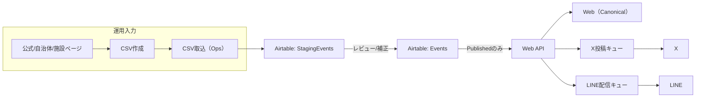
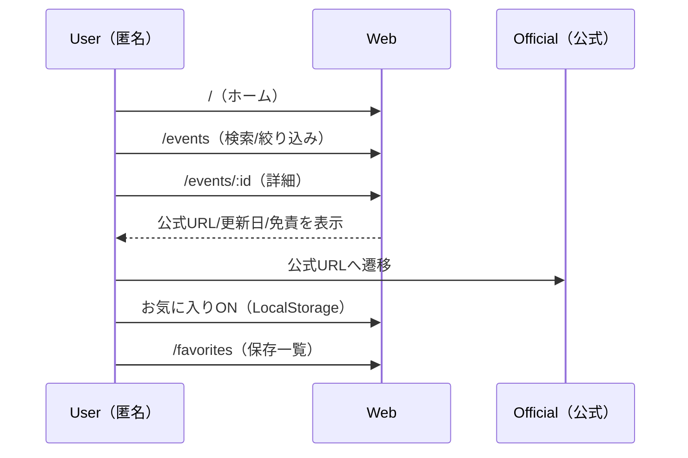
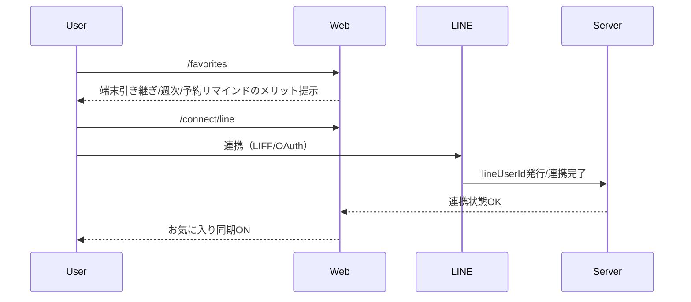
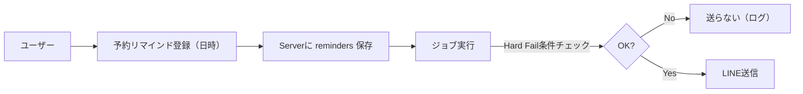

# キッズお出かけ情報 - フロー図（v0.2）

- 更新日: 2026-01-01
- 対象: Web（Canonical） + X（イベント単位拡散） + LINE（新規/予約リマインド/週次）
- SoT: Airtable（Events / StagingEvents）
- この資料の目的: **システムフロー / 運用フロー / ユーザーフロー** と **画面構成案** を一体で定義

---

## 1. 前提（要点）
- 登録強制はしない（匿名でお気に入り保存→任意でLINE連携）
- Web詳細はCanonical（必須: 公式URL/更新日/免責）
- 公開はPublishedのみ
- 予約リマインドは誤爆すると信用が即死するため **Hard Failで止める**

---

## 2. 画面構成案（公開UI）

| 画面 | URL | 主目的 | 主なUI要素（案） |
|---|---|---|---|
| ホーム | `/` | 探索開始・週末導線 | 検索バー、datePreset（今日/今週/週末）、エリア、年齢、人気カテゴリ、週末特集、匿名OKの説明 |
| 一覧 | `/events` | 絞り込み検索 | フィルタ（datePreset/期間/エリア/年齢/カテゴリ/価格/予約要否）、ソート、カード、0件UI（条件緩和/週末/人気） |
| 詳細（Canonical） | `/events/:id` | 信頼性表示と公式導線 | 公式URL（ボタン）、更新日、免責、お気に入り、予約情報、Xシェア |
| 週末特集 | `/weekend` | 0件回避/週次の着地 | 対象期間、軽い絞り込み、特集枠（編集orルール）、カード |
| お気に入り | `/favorites` | 保存のハブ | 保存一覧（匿名: LocalStorage）、端末依存の注意、LINE連携CTA |
| LINE連携 | `/connect/line` | 同期/通知へ誘導 | メリット（週次/予約/引き継ぎ）、データ利用説明、連携ボタン |

### 2.1 画面構成案（Ops UI）
| 画面 | URL | 主目的 | 主なUI要素（案） |
|---|---|---|---|
| CSV取込 | `/ops/import-csv` | 取り込み入口 | アップロード、プレビュー（件数/エラー/重複候補）、Staging反映 |
| ステージング | `/ops/staging` | 品質担保 | エラー/警告一覧、重複マージ、Events昇格、Publish操作 |
| イベント編集 | `/ops/events/:id` | 手修正 | 必須欠落の補正、ステータス管理（Published制約） |

---

## 3. システムフロー（全体）


---

## 4. 運用フロー（CSV→公開→配信）
```mermaid
flowchart TD
  A[一次情報確認（公式URL）] --> B[CSVテンプレ入力]
  B --> C[/ops/import-csv アップロード]
  C --> D[自動バリデーション]
  D -->|Error: 取り込み拒否| E[修正して再アップロード]
  D -->|OK/Warning| F[StagingEventsへ反映]
  F --> G[/ops/staging レビュー/補正]
  G --> H[Eventsへ昇格]
  H --> I[status=Published]
  I --> J[Web公開]
  I --> K[X/LINEキュー登録]
  K --> L[X投稿/LINE配信（冪等）]
```

### 4.1 運用ガードレール（抜粋）
- Events直書き禁止（Staging経由）
- Published要件（officialUrl/updatedAt）未満はPublish不可
- 配信は `eventId + channel + templateVersion` の冪等キーで二重送信防止

---

## 5. ユーザーフロー（利用フロー）

### 5.1 匿名ユーザー（登録なし）


### 5.2 LINE連携ユーザー（任意連携）


### 5.3 予約リマインド（誤爆防止）


Hard Fail例（1つでも満たしたら送らない）
- lineUserId無し
- eventがPublishedでない
- remindAtが過去
- officialUrl欠落

---

## 6. CSV取り込み仕様（要点）

### 6.1 必須列
- title
- officialUrl
- updatedAt

### 6.2 推奨列
- startAt / endAt / areaSlug / areaName / venueName / address
- ageLabel / categories / priceText
- reservationRequired / reservationUrl

### 6.3 バリデーション
- Error（取り込み拒否）: title空、officialUrl不正、updatedAt不正
- Warning（取り込みはする）: startAt欠落、categories欠落

---

## 7. 反対意見（批判）と対策（抜粋）
- 匿名ファーストはLTVが弱い → `/favorites` で連携メリットを具体化し、摩擦低く誘導
- Airtable運用は口約束だと崩れる → Published要件をシステム制約化
- Xは費用対効果が不透明 → 低頻度・高品質で検証し、UTMで継続判断

---

## 8. 2回検証（本資料）

### 検証1: 導線の跳躍
- [x] 公開UIは「ホーム→一覧→詳細→公式/お気に入り」の一本道がある
- [x] 匿名のお気に入りは `/favorites` に集約し、連携導線もここに統一
- [x] 0件時の着地が `/weekend` と条件緩和で担保される

### 検証2: 運用/配信の事故
- [x] Published要件がOps/システム制約として明文化
- [x] 予約リマインドはHard Failで止める設計
- [x] 冪等キーで二重送信/再投稿を抑制
